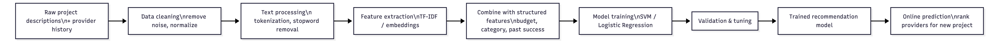
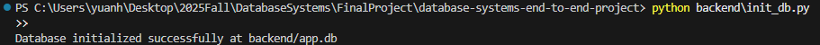
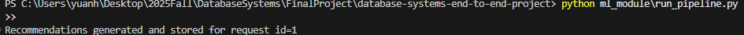
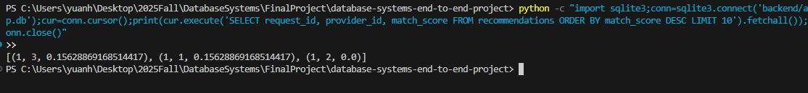
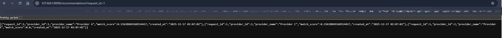

# Database Systems Final Project
## End-to-End Data-Driven Database Application (Part IV)

### Overview
This repository contains the final deliverables for **CSCI-GA.2433 Database Systems (NYU Courant)**, including Parts **I–IV**.

Part IV implements a **local, runnable end-to-end prototype** that demonstrates the same *end-to-end behavior* required by the spec:
- Persist structured data in an OLTP/ODS relational database
- Process unstructured text via a data-driven / ML module
- Write ML “insights” back into the operational database
- Expose results through an API (workflow consumption)

> Note: Parts I–III describe a cloud-target reference architecture (Azure Data Lake / Databricks / Synapse / Azure ML). Part IV provides a **local equivalent** (SQLite + FastAPI + scikit-learn) so the grader can run and verify end-to-end execution quickly.

---

## End-to-End Architecture (Concept + Local Demo Mapping)
### Reference Architecture (target)


### Workflow Diagram


### Part III ML Pipeline (design)


---

## Technology Stack (Part IV runnable demo)
- **Backend API:** Python + FastAPI
- **DB (OLTP/ODS demo):** SQLite
- **Analytics / ML:** scikit-learn (TF‑IDF + cosine similarity)
- **API Server:** Uvicorn

---

## How to Run (Local End-to-End Demo)

### Prerequisites
- Python 3.10+
- Git

### Step 1 — Clone the repository
```bash
git clone https://github.com/haoboyy/database-systems-end-to-end-project.git
cd database-systems-end-to-end-project
```

### Step 2 — Install dependencies
```bash
python -m pip install -r backend/requirements.txt
```

### Step 3 — Initialize the database
```bash
python backend/init_db.py
```

### Step 4 — Run the data-driven ML pipeline (writes insights back to DB)
```bash
python ml_module/run_pipeline.py
```

### Step 5 — Start the backend API server
```bash
python -m uvicorn backend.app:app --reload
```

Open:
- http://127.0.0.1:8000  
- (Optional) Swagger UI: http://127.0.0.1:8000/docs

### Step 6 — Verify end-to-end execution (screenshots)
These screenshots demonstrate the full run:
- DB initialized: `screenshots/01_db_init.png`
- ML pipeline executed: `screenshots/02_ml_pipeline.png`
- Recommendations stored in DB: `screenshots/03_recommendations_table.png`
- API response: `screenshots/04_api_response.png`






---

## Repository Structure (Matches Current Repo)
```text
backend/
  .keep
  app.py
  init_db.py
  requirements.txt

diagrams/
  .keep
  reference_architecture.png
  workflow.png

docs/
  data_governance_dikw.md
  implementation_mapping.md
  query_optimization.md
  reference_architecture.md
  use_case_and_process.md

ml_module/
  .keep
  run_pipeline.py

part1/
  EDA_ERD.pdf
  Report.docx

part2/
  Architecture.png
  ERD.png
  Logical_Schema.sql
  Report.docx

part3/
  Data Lake Layers and ETL Flow.png
  Lakehouse-Based Cloud Analytics Architecture on Azure.png
  MLPipeline.png
  Proposal Submission Workflow.png
  Report.docx
  physical_schema.sql

screenshots/
  .keep
  01_db_init.png
  02_ml_pipeline.png
  03_recommendations_table.png
  04_api_response.png

sql/
  .keep
  schema.sql
  seed.sql

.gitignore
README.md
```

---

## Notes for Grading Alignment (Part IV Spec)
- **Use case + process documentation:** `docs/use_case_and_process.md`
- **Reference architecture + governance:** `docs/reference_architecture.md`, `docs/data_governance_dikw.md`
- **Optimization discussion:** `docs/query_optimization.md`
- **All parts included:** `part1/`, `part2/`, `part3/`, and runnable Part IV code (`backend/`, `ml_module/`, `sql/`)  
